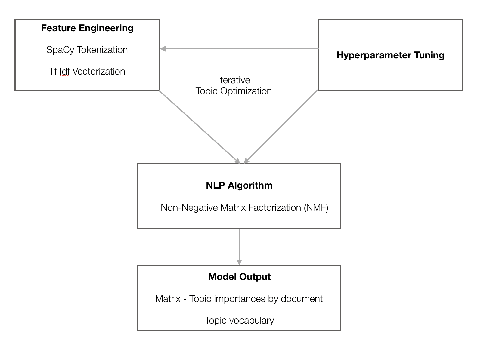
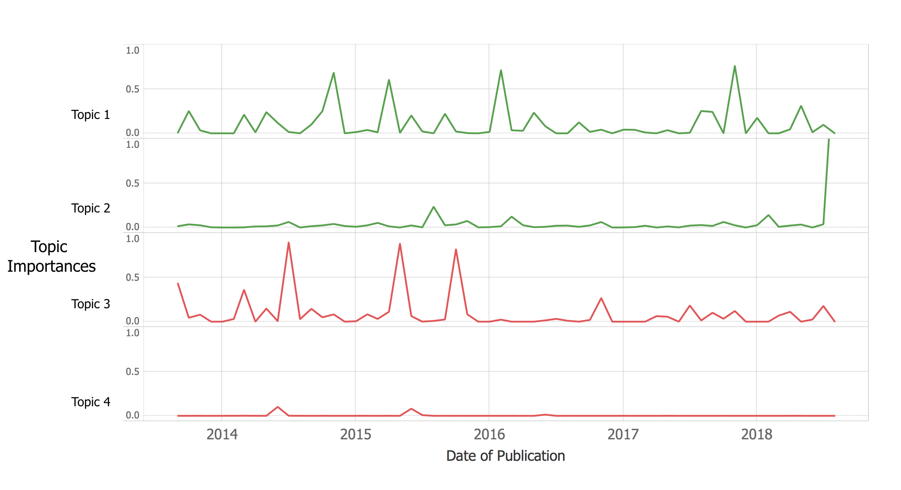
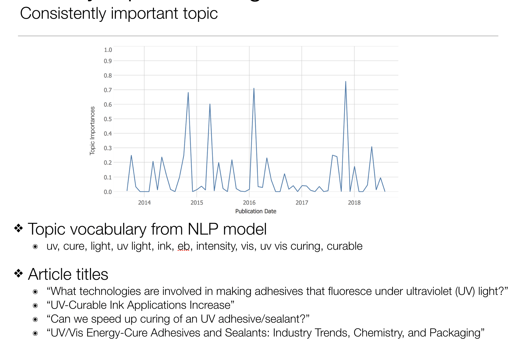
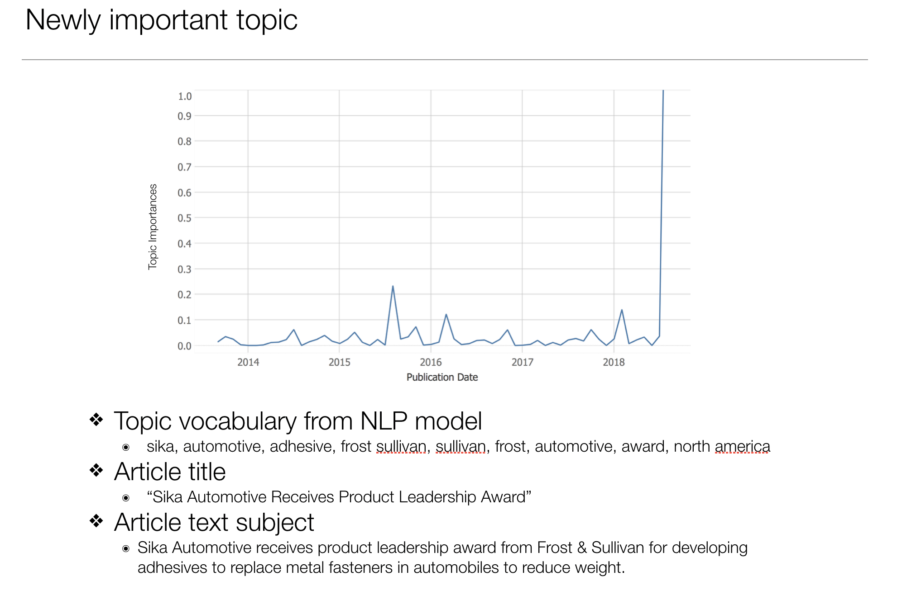

# Trade Publication Topic Analysis
Using natural language processing (NLP) to identify new market development opportunities from a trade publication.

## Summary
Building the market knowledge needed to identify new market development opportunities can be costly and time consuming for industrial companies.  There is a large amount of information available at no or little cost on the internet.  Reading through all of it to gather needed insights is time consuming.  It often must be done by costly experts that understand specific technology to be effective.  A method to reduce the volume of information that needs to be read by experts could make this process more efficient.

It is reasonable to assume that topics important to a market will appear more frequently in various platforms on the internet.  Natural language processing (NLP) works well to measure the frequency with which specific combinations of words ("topics") appear in a selection of text ("corpus").  NLP is also effective at identifying changes over time in the frequency of appearance of topics by comparing topic frequency in a particular corpus at different times.  This can be used to determine which topics are new, and which topics are growing in their appearance frequency.  These capabilities allow NLP to be used to identify selections of text that are most important to a market so that these can be focused on to identify insights for development.

Trade publications focus on specific industrial markets and selecting those focused on a market that is thought to be promising for development can be an initial step in choosing text likely to provide insights.  I have some experience/expertise in the industrial adhesives market so I chose this industrial market for the focus of this project.  To support proof of concept, I chose a trade magazine titled "Adhesive & Sealants Industry" as the corpus for the project and decided to use issues (the magazine is published monthly) from the last five years (August 2013 - August 2018).  The goal for the project was to identify topics from the corpus with strong importance (high, consistent frequency) or that are new (appeared only recently) using NLP.

Python code for the project can be found in Jupyter Notebooks in the **Notebooks** folder.  Two notebooks are included, **trade_topic_scraping.ipynb** containing code for scraping text from the internet and storing it in a Mongo NoSQL database to serve as the corpus for the project, and **trade_topic_analysis.ipynb** containing code for the NLP analysis.

Presentation slides of the findings from the project can be found in the **Presentation** folder in pdf format.

## Findings
A range of text preprocessing options from NLTK and SpaCy, a count vectorizer and tfidf vectorizer, and LDA and NMF models were evaluated on the corpus via the topic optimization process shown below.

Using SpaCy to change upper case words to lower case, remove punctuation and remove stop words and then tokenizing the text, followed by vectorizing using the tfidf vectorizer for text preprocessing, followed by topic modeling using a non-negative matrix factorization (NMF) model produced the most meaningful and best differentiated topics.

Topic "importances" over time were determined by plotting the topic probabilities output by the NMF model after normalizing for individual articles from the trade magazine versus article publication dates.  These plots were visualized by creating Pandas dataframes of the probabilities grouped by month for each topic with a column for each topic and a row for each month and importing the data into Tableau.

Plots for four example topics can be seen below.

Topic 3 showed strong importance until 2016 when importance fell away.  Topic 4 showed weak importance throughout the five year period from which data was taken.  These are examples of topics that would not be good to consider for exploration for market development.

Topic 1 showed consistently strong importance throughout the five year period from which the data was taken.  Topic 2 showed very strong importance in August 2018 indicating that it may represent a newly developing topic important to the market.  These two topics would be good for further exploration for market development.

Subject matter for the two topics identified as good for exploration was identified using the topic vocabulary from the NMF model and from the article titles and text for the articles in which the topic was important.  Some of this information can be seen for each  of these two topics below.

Subjects identified for these two topics are:
* Topic 1 - Adhesives and inks with functionality from exposure to UV or visible light.
* Topic 2 - Reducing the weight of automobiles by replacing metal fasteners with adhesives.

This information can be used to target specific market development exploration activities.  Authors of the articles that produce the strong importance for these topics are included in the Mongo database.  They are likely to be good expert contacts for further information as part of this exploration.

## Data Description
Text that makes up the corpus for this project was taken from Adhesives & Sealants Magazine.  Information can be found on its website [here](https://www.adhesivesmag.com/publications/3-adhesives-and-sealants-magazine).  Registration on use of the registered login information is needed to access magazine content including the current and archived issues.  Monthly issues articles dating from August 2013 to August 2018 were scraped to become the corpus for this project.

## Code Narrative
Code to scrape article text and store it along with article title, publication date and author in a mongo NoSQL database is in the Jupyter Notebook **trade_topic_scraping.ipynb**.  Libraries and modules needed to run the code are imported at the beginning of the notebook.

The **start_selenium_driver function**:
* Opens the selenium web browser driver for the Google Chrome browser and returns the driver.

The **login_adhesives function**:
* Takes the selenium driver from the "start_selenium_driver" function as an input parameter.  
* Uses my login credentials to log in to the Adhesives & Sealants Magazine web site.

The **get_current_month_article_urls function**:
* Takes the current month in the format like "August 2018" as an input parameter.
* Navigates to the web page for the current month using the selenium driver.
* Creates a BeautifulSoup page object using the selenium driver to capture the source code and the BeautifulSoup html parser.
* Creates an empty list in which to hold the urls for the articles in the issue.
* Loops through the html article references on the web page and appends the url for the article pages to the list.
* Creates an empty list in which to hold unique article urls.
* Loops through the urls in the initial list and appends article urls but not article comments urls.
* Converts the list to a set to remove duplicates.
* Returns the list of unique article urls.

The **get_articles function**.
**Note**: This function requires opening the mongo database client for Python using the "adhesives" database and "articles" collection before running it.
* Takes the list of unique article urls for the current month from the "get_current_month_article_urls" function as an input parameter.
* Loops through the urls in the list and:
  * Uses the selenium driver to navigate to the article web page.
  * Parses the html using BeautifulSoup
  * Creates an empty dictionary in which to store scraped information.
  * Scrapes title, date, author and text body for the article from the web page and stores them in the dictionary.
  * Includes "missing information" messages in the dictionary if any of the above values are not present for an article.
  * Inserts the dictionary as a record in the mongo "adhesives" database "adhesives" collection.
  * Prints the article title.

The next five code cells:
* Starts the selenium driver using the "start_selenium_driver" function.
* Logs into the Adhesives & Sealants web site using the "login_adhesives" function.
* Gets the list of unique article urls from the current month magazine issue ("August 2018") using the "get_current_month_article_urls" function.
* Opens the mongo database Python client using the "adhesives" database and "articles" collection.
* Clears any past records from the database.
* Gets records for articles in the current month magazine issue.

The **get_archived_article_urls function**:
* Takes the current month in the format like "August 2018" and the "oldest issue" as the number of past months to be scraped as an integer as input parameters.  This defines the range of issues to be scraped. The web site uses the number of months into the past to identify past month issues.
* Uses the selenium driver to navigate to the bottom of the home page (opens source code for current issue page).
* Uses the selenium driver to navigate to the current issue web page.
* Creates an empty list in which to hold article urls.
* Loops through each of the past issues from last month to the number of months past given by the "oldest_issue" parameter and:
  * Uses selenium to navigate to the archived issue drop down list.
  * Uses selenium to navigate to the past issue web page.
  * Parses the html using BeautifulSoup.
  * Uses BeautifulSoup to scrape urls for articles on web page.
  * Appends url to list.
* Creates an empty list in which to hold unique article urls.
* Loops through the urls in the initial list and appends article urls but not article comments urls.
* Converts the list to a set to remove duplicates.
* Returns the list of unique article urls.

The next five code cells:
* Starts the selenium driver using the "start_selenium_driver" function.
* Logs into the Adhesives & Sealants web site using the "login_adhesives" function.
* Gets the list of unique article urls from the the past 60 months magazine issues (with current month of August 2018) using the "get_archived_article_urls" function.
* Prints the count or article records present in the mongo database.

Final code for analysis of the corpus made up of the combination of text in the "text_body" field in each record in the "articles" collection of the mongo "adhesives" data base created by the code in the notebook "trade_topic_scraping.ipynb" is given in the notebook **trade_topic_analysis.ipynb**.  Libraries and modules need to run the code are given at the beginning of the notebook.  Modules are included that are not used in this final code version and represent preprocessing and modeling options that were evaluated but found not to provide results as useful as those used.  Code and analysis of this evaluation is not included in the notebook to simplify the project presentation.  These unused modules are:
* nltk (except for stopwords library)
* sklearn.feature_extraction.text.CountVectorizer
* sklearn.decomposition.LatentDirichletAllocation
* sklearn.decomposition.TruncatedSVD

The **spacy_tokenizer function**:
* Takes a corpus of text as the input parameter "sentence".
* Creates a list of stopwords by combining the list give by scikit learn and by nltk.
* Creates a list of punctuation symbols using the list provided by the Python string library and adding some custom symbols found in the project corpus.
* Tokenizes the corpus using SpaCy tokenizer.
* Converts upper case words to lower case except for those identified as pronouns by SpaCy.
* Removes stopwords and punctuation.
* Returns tokens

The **vectorize_and_model function**:
* Takes a vectorizer, model and corpus ("text") as input parmeters.
* Fits and transforms the corpus using the vectorizer.
* Fits and transforms the vectorized text using the model.
* Returns fit model

The **display_topics fuction**:
* Takes a model, feature names (from vectorizer), and number of topic vocabulary words to return ("no_top_words").
* Loops through topics from the model and:
  * Prints Topic Number
  * Prints topic vocabulary

The **"Read Text Data"** code cells:
* Opens a Python mongo client using the "adhesives" database and the "articles" collection.  This contains the text that becomes the corpus for the project.
* Creates an empty list to hold the text from the articles in the database.
* Puts the text from each article into the list.
* Prints the text from the last article in the database.

The **"NMF Analysis"** code cells:
* Defines tfidf vectorizer with parameters.
* Defines NMF model with parameters.

The **View Model Output"** code cells:
* Runs the "vectorize_and_model" function using the tfidf vectorizer and nmf model fro the "NMF Analysis" code on the corpus from the "Read Text Data" code.
* Prints the shape of the model output matrix.
* Prints the topic vocabularies.
* Prints the model output data matrix.
* Prints the column (topic) sums from the output data matrix.

The **Graphical Topic Analysis** code cells:
* Normalizes the model output topic "importances" by dividing each topic importance by the total of the document importances.
* Converts the normalized model output matrix to a Pandas dataframe.
* Opens a cursor instance to read from the mongo database.
* Reads database records into a Pandas dataframe.
* Drops the text data from the dataframe.
* Merges dataframe with topic importance dataframe from "View Model Output" code.
* Converts article publication date values to datetime type.
* Drops rows with corrupt dates (before 2013)
* Drops columns except for date and topic importances.
* Converts datetime date to "year-month" string values.
* Groups articles by year-month string and sums importances into a new dataframe.
* Prints plots of topic importance sum by year-month string value (by month, by year) in groups of 20.

Important topic examples were selected visually by looking at the displayed topic importance plots.

The **Evaluate Document Details for Consistent and New Importance Topics and Output for Visualization** code:
* Displays article titles for topic identified as "Newly Important" (topic 40).
* Displays topic importance plot.
* Creates new dataframe with topic importances for "Newly Important" (topic 40) from grouped model output.
* Resets index.
* Renames columns.
* Converts date values to datetime type.
* Writes dataframe to Excel worksheet to support Tableau visualization.
* Displays article titles for topic identified as "Consistently Important" (topic 8).
* Creates new dataframe with topic importances for "Consistently Important" (topic 8) from grouped model output.
* Resets index.
* Renames columns.
* Converts date values to datetime type.
* Displays topic importance plot.
* Writes dataframe to Excel worksheet to support Tableau visualization.

The **Output multiple topics for visualization** code cells:
* Creates new dataframe with topic importances for "Example Topics" (topics 20, 74, 8, 40) from grouped model output.
* Resets index.
* Renames columns.
* Converts date values to datetime type.
* Writes dataframe to Excel worksheet to support Tableau visualization.
